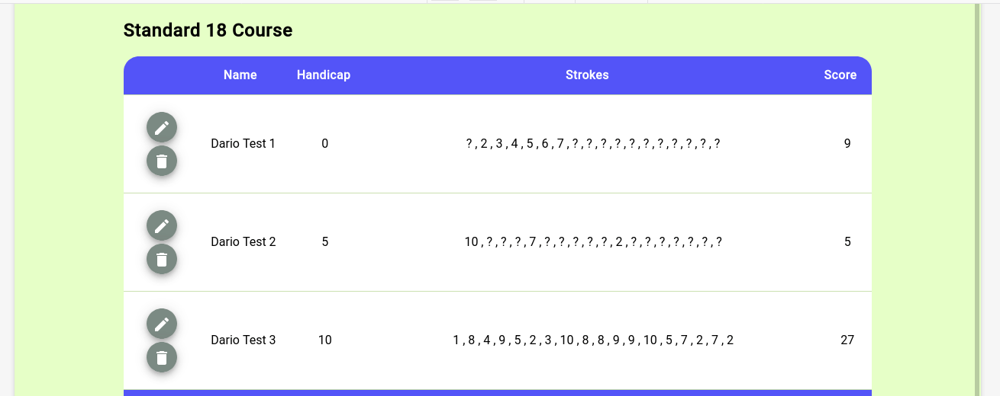
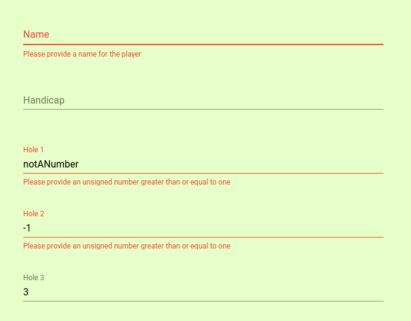

# Angular7 Golf Miniproject
This repository contains a short project which was assigned to me and other developers at work as an angular workshop in which a problem was presented to us and we had two weeks to write an angular solution for it.
\
\
Each day we could take half an hour to work on this side-project and my result is the application present here.
\
\
The problem consisted in creating an application used to score players for a 18-hole golf course which uses the stableford scoring system, no other specifications have been given to us leaving the solution's implementation entirely up to the developer.
\
\
My solution was to create an application which would allow the user to add new players, edit their scores and view the given details and total score in tabular form.

## My Goals
Follows a list of the goals I set up to ( and did ) achieve throughout this small workshop (ordered by the importance I gave them):
* Learn [NGRX](https://ngrx.io/) as I had no previous knowledge of it, that is the way my application manages state (for my implementation I've followed Gary Simon's
[Angular Ngrx Store Tutorial](https://coursetro.com/posts/code/151/Angular-Ngrx-Store-Tutorial---Learn-Angular-State-Management)).
* Exercise in having Smart and Dumb component, deciding which components are only presentational and which should also have logic in them.
* Set up and use reactive forms efficiently using the standard form builder, this is how I set up the edit user form (I took inspiration from Kara Erickson's [AngularConnect 2016 - Talk on Angular 2 Forms](https://youtu.be/xYv9lsrV0s4)).
* Handle data asynchronously, as NGRX already provides data efficienly as observables I wanted to have the data flow through the application cleanly and efficiently by using the async pipe (rather than subscribing and setting classes fields based on observables' values).
* Set up the application to be mobile friendly by using CSS Grid system, this is especially evident in the users table (for this I took inspiration from Morten Rand-Hendriksen's [CSS Grid Changes Everything Talk](https://youtu.be/txZq7Laz7_4) and also [A Complete Guide to Grid](https://css-tricks.com/snippets/css/complete-guide-grid/) from Css-Tricks ).
* Learn and experience a bit [Angular Material](https://material.angular.io/), thus I included various *mat* components in the application.

## Notes
* The application data is not persistent, as a small workshop project data persistence was not the focus
* Just in order to show the application's functionality I set its initial state to already have three test players with various scores, normally those users would not be present
* At the start of the application you can see an empty page with a start button, at the start of the project I planned to have a select list of various courses in this page, and after selecting one the user would interact with that specific course, there could be a bunch of different ones and not only with 18-holes but with any possible number of holes, I did not find the time implement this and the idea (for which the code is already set up for) can also bee seen from the fact that nowhere in the application I directly use the number 18 as a constant, but extract it from the lenght of the course's holes list. Other related signs of this idea can be seen throught the application, like by the course's id and name and the way routing was set up.
* I've used the angular CLI to create the various components, I did not care about the spec files, I just thought that if I'd have the time I'd add unit testing to the project, that's the reason why I leaved them in.
* When setting up the application I choose CSS as I thought to keep it simple and not rely on SASS, this is acutally something that I regret as it did not give any benefit and made more clean solutions not applicable, the overall difference in such a small project was anyway rather small so I just thought to keep it this way anyway.
* I implemented (as it was suggested to me by the team leader after chatting about NGRX) a way not to use the NGRX store directly into my componets but instead I've created a service which would interact with it instead and have that injected into my component. This was a nice suggestion to which I agree to as it makes the app rely less on NGRX, which could be swapped with other similar state management libraries if need be without the need to refactor the code across all the application.

## Screenshots
Follow some screenshots of the application:

* Main page with users table: 

* Responsive user table implemented with css grid: 

* Part of user edit form, implemented with angular material fileds and validation errors: 

## Deployment
The application has been deployed on github pages (as described in the official [Angular documentation](https://angular.io/guide/deployment#deploy-to-github-pages)) and it can be viewed at: https://dario-piotrowicz.github.io/Angular7_golf-miniproject/

## Golf
The project is not really about golf, the sport was only speficied to give a specific type of problem which needed to be understood by the developer and solved by the application.
\
\
In any case the following links describe the scoring system used in the application:
* https://en.wikipedia.org/wiki/Stableford

* https://www.bunkered.co.uk/golf-news/stableford-the-golf-scoring-system-explained
