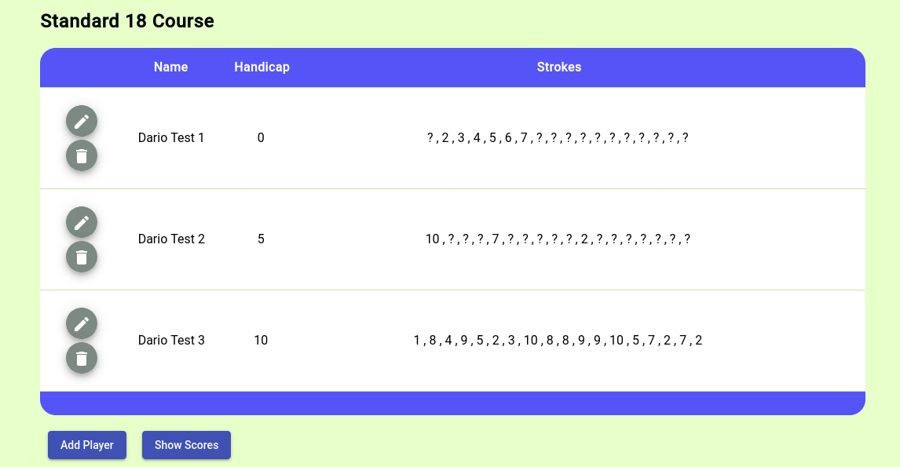

# Angular7 Golf Miniproject
DESCRIPTION HERE \
2 weeks, half an hour each day \

## My Goals
I wanted to learn NGRX and Angular Material
Use reactive forms efficiently
Handle data asynchronously
Smart/Dumb components
Mobile Friendly via CSS Grid

## Screenshots
Follows some screenshots of the application

## Deployment
The application has been deployed on github pages ( as described in the official [Angular documentation](https://angular.io/guide/deployment#deploy-to-github-pages) ) and it can be viewed at: https://dario-piotrowicz.github.io/Angular7_golf-miniproject/

## Golf
The project is not really about golf, the sport was only speficied to give a specific type of problem which needed to be understood and solved by the application.
\
\
In any case the following links describe the scoring system used in the application:
* https://en.wikipedia.org/wiki/Stableford

* https://www.bunkered.co.uk/golf-news/stableford-the-golf-scoring-system-explained
